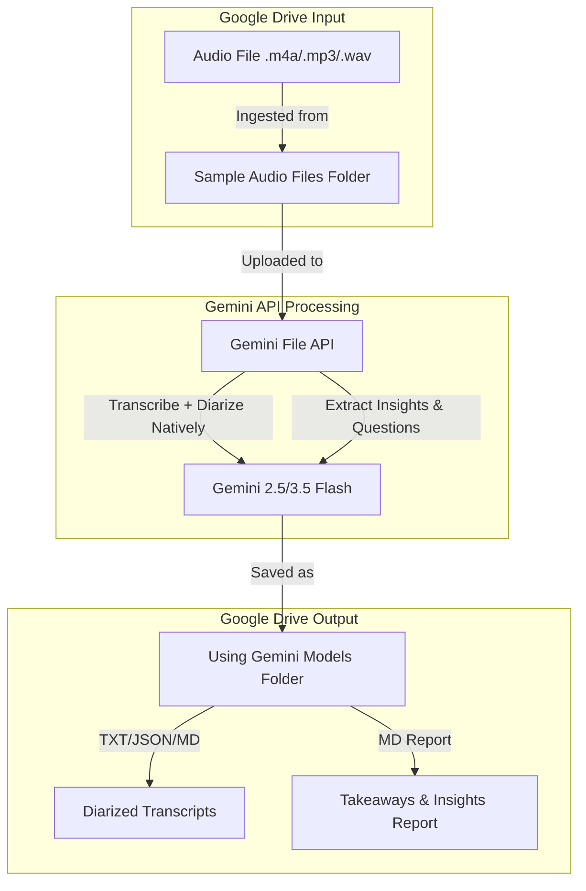

# 🎙️ Gemini Direct Transcription & Dual-Script Workflows

This directory contains Jupyter notebooks that utilize the **Gemini API** (via the modern `google-genai` SDK) to directly transcribe, diarize, and analyze audio files. 

Because the Gemini API has advanced native audio understanding capabilities, these workflows **do not require local speaker diarization (Pyannote) or local noise clearing (noisereduce)**, making them extremely lightweight and runnable on standard CPU runtimes in Google Colab (no T4/L4 GPU required, and no HF community model terms to accept).

---

## 🗺️ Visual Directory Workflow



---

## 📂 Notebooks Overview

### 1. ⚡ [Gemini Direct Audio Transcription & Insights](Gemini_Direct_Audio_Transcription_and_Insights.ipynb)
A streamlined, lightweight workflow designed to:
- Ingest an audio file from Google Drive.
- Perform direct transcription and speaker diarization via the Gemini API.
- Save a structured transcript containing timestamps and speaker attributions.
- Analyze the conversation to extract key agricultural/socioeconomic insights, concerns raised, and potential follow-up questions.

### 2. 🔀 [Gurmukhi-Devanagari Dual-Script Transcription Workflow](Gurmukhi-Devanagari%20Dual-Script%20Transcription%20Workflow.ipynb)
A specialized transcription workflow that transcribes Punjabi conversations and uses Gemini to perform linguistic transliteration to Devanagari script (Hindi characters) while preserving dialect nuances and conversational structure.

---

## 📂 Input & Output Folder Map

To keep outputs organized, the notebooks route files according to the following conventions:

| Action | Path | Description |
| :--- | :--- | :--- |
| **Ingestion (Input)** | `/content/drive/MyDrive/AnnamAI Tasks/Outreach Activity STT + Question Generation Workflow/Sample Audio Files/` | Place raw audio recordings here. |
| **Storage (Output)** | `/content/drive/MyDrive/annam AI tasks/outreach activity/transcription result/pipeline AI fallback results/[video_id]/` | Saves outputs inside a folder matching your audio filename. |

### Generated Output Files
- `[video_id]_gurumukhi.txt`: The raw word-for-word transcript in Gurmukhi script.
- `[video_id]_devanagari.txt` / `_devanagari_insights.md`: Transliterated text and insights report.

---

## 🔒 Credential Security (Git Best Practices)

To ensure API keys are never exposed in commits to Git:
1. **No Hardcoded Keys**: The notebooks never contain plain text API keys.
2. **Secrets Manager Integration**: The client is initialized using:
   ```python
   from google import genai
   from google.colab import userdata
   client = genai.Client(api_key=userdata.get('GEMINI_API_KEY'))
   ```
3. **Setup Guide**: Before running the notebook, add your Gemini API Key in Google Colab's **Secrets (🔑)** tab on the left sidebar:
   - **Name**: `GEMINI_API_KEY`
   - **Value**: Your Gemini API Key
   - **Notebook Access**: Toggle ON.
