# 📊 Fallback Pipeline Master Guide

This folder contains the **local, offline fallback options** for each step of the Speech-to-Text and Insights Pipeline. If you do not have internet access or a powerful GPU to run the main pipeline, you can use these individual notebooks as alternatives.

---

## 🗺️ 6-Step Workflow & Options

Here is the visual diagram showing the 6 stages of the pipeline and the **top 2 methods (options)** available for each stage:

```mermaid
graph TD
    classDef stepClass fill:#f9f,stroke:#333,stroke-width:2px;
    classDef optClass fill:#bbf,stroke:#333,stroke-width:1px;

    Step1["1. Audio Ingestion<br>(Standardize Audio File)"]:::stepClass
    Step1 --> Option1a["Option 1: FFmpeg CLI (Fast System Tool)"]:::optClass
    Step1 --> Option1b["Option 2: Pydub (Simple Python Code)"]:::optClass
    
    Step2["2. Noise Suppression<br>(Clean Background Noise)"]:::stepClass
    Step2 --> Option2a["Option 2.1: DeepFilterNet (Smart AI Filter)"]:::optClass
    Step2 --> Option2b["Option 2.2: RNNoise (Mozilla Speech Filter)"]:::optClass
    
    Step3["3. Speaker Diarization<br>(Who Spoke When?)"]:::stepClass
    Step3 --> Option3a["Option 3.1: WhisperX (High Accuracy GPU)"]:::optClass
    Step3 --> Option3b["Option 3.2: FunASR (Lightweight CPU CAM++)"]:::optClass
    
    Step4["4. Merging Speaker Turns<br>(Combine Consecutive Speech)"]:::stepClass
    Step4 --> Option4a["Option 4.1: Pandas Grouping (Fast Table Merging)"]:::optClass
    Step4 --> Option4b["Option 4.2: Pure Python (Simple Loop Merging)"]:::optClass
    
    Step5["5. Audio Splitting<br>(Cut Waveform by Speaker)"]:::stepClass
    Step5 --> Option5a["Option 5.1: Pydub Slicing (In-Memory Slicing)"]:::optClass
    Step5 --> Option5b["Option 5.2: SoundFile Reading (Disk-Block Slicing)"]:::optClass
    
    Step6["6. Transcription<br>(Speech-To-Text Cloud APIs)"]:::stepClass
    Step6 --> Option6a["Option 6.1: Gemini API (Google Cloud AI)"]:::optClass
    Step6 --> Option6b["Option 6.2: Sarvam API (Indian Languages ASR)"]:::optClass
```



---

## 📚 Explanation of Steps & Options

### 1. Audio Ingestion (Preparing the Audio)
This step converts your audio files (MP3, M4A, OGG) into a standardized format (**16kHz mono WAV**) so the diarization and transcription tools can read it correctly.
* **Option 1: FFmpeg CLI** – Runs a fast command-line app behind the scenes. Extremely fast and does not use much computer memory.
* **Option 2: Pydub** – Opens and converts the file using a simple Python script. Very easy to read, but loads the entire file into RAM, which can slow down large files.

### 2. Noise Suppression (Cleaning Background Noise)
This step removes background noise like wind, static hiss, or street noise from your recordings.
* **Option 1: DeepFilterNet** – Uses a smart AI model to recognize voices and filter out background noise and echo. Runs fast on normal computer processors (CPUs).
* **Option 2: RNNoise** – Uses Mozilla's tiny, pre-trained neural network. Extremely lightweight and fast, but requires a C compiler to install.

### 3. Speaker Diarization (Detecting Who Spoke When)
This step identifies different speakers in the audio and creates a chronological timeline of their turns.
* **Option 1: WhisperX** – Gives highly precise word-level timestamps without speaker overlap. Requires a graphics card (GPU) to run fast.
* **Option 2: FunASR** – A lightweight model from Alibaba that groups speakers on CPU. Very good at handling regional accents.

### 4. Merging Speaker Turns (Combining Short Turns)
If the same speaker talks twice with only a tiny pause between their turns, this step merges those turns into one block and calculates speech statistics.
* **Option 1: Pandas Grouping** – Uses table calculations to merge turns. Extremely fast for long files.
* **Option 2: Pure Python** – Goes through the timeline item-by-item using basic Python loops. Needs no extra libraries, but can be slower for huge files.

### 5. Audio Splitting (Cutting Audio by Speaker)
This step cuts the main recording into smaller audio files containing only one speaker's voice.
* **Option 1: Pydub Slicing** – Cuts and joins the audio in memory. Very simple to use, but uses a lot of RAM.
* **Option 2: SoundFile Reading** – Cuts files by reading directly from your hard drive block-by-block. Safe for massive files because it won't run out of memory.

### 6. Audio Transcription (Writing Down the Words)
This step converts the voice segments into text using cloud AI services.
* **Option 1: Gemini API** – Google's cloud model that listens to the audio and writes highly accurate transcripts.
* **Option 2: Sarvam API** – A cloud service specialized for Indian languages (like Hindi and Punjabi) and local accents.

---

## 📂 Google Drive Output Folder

When the pipeline notebook is run, all outputs (JSON transcripts, text files, and insights reports) are saved to your Google Drive at the following path:
```text
/content/drive/MyDrive/annam AI tasks/outreach activity/transcription result/backup fallback strategies/
```

---

## 📑 Output File Map

For each audio file processed (e.g., `MarauliKhurad3`), the following files will be created in its respective subfolder:

| File Name | Format | Description |
| :--- | :--- | :--- |
| `[video_id]_diarized_transcript.txt` | Text | Verbatim transcript with speaker labels and timestamps. |
| `[video_id]_diarized_transcript.md` | Markdown | Styled transcription report for documentation. |
| `[video_id]_diarized_transcript.json` | JSON | Structured data array containing `time`, `speaker`, and `text` segments. |
| `[video_id]_SPEAKER_XX_transcript.txt` | Text | Transcript containing only the speech turns for a specific speaker. |
| `[video_id]_devanagari_insights.md` | Markdown | Devanagari script conversion and qualitative outreach insights report. |
